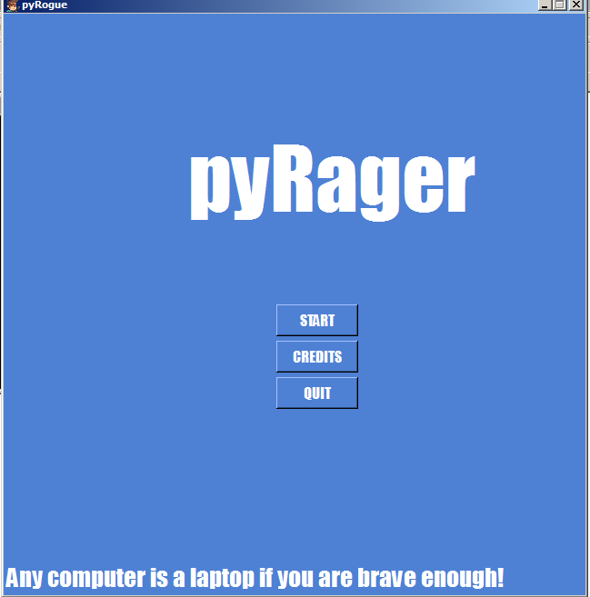
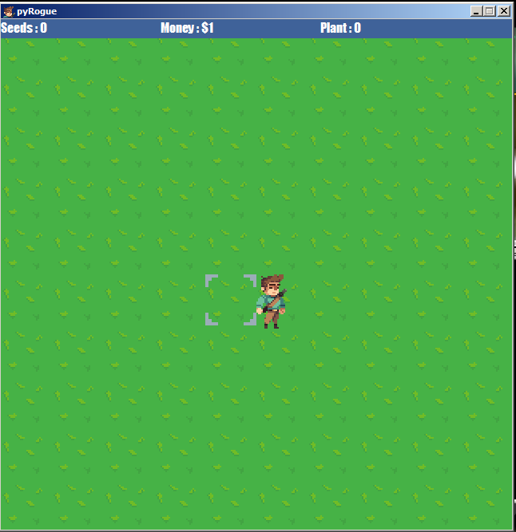
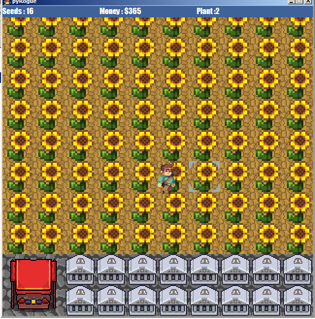

# pyRager
The following project is a game made in Python using the tkinter module as a school project.

tkinter is used as it is mentioned in Appendix B of Computer Science with Python
by Sumita Arora, Class XII

The following project is a farming game in which the player starts a small farm and then
slowly builds it to an exotic green heaven.
There is also a small market at the bottom left.

CONTROLS:  
1. W/A/S/D or Up/Left/Down/Right arrow keys to move  
2. Mouse Click to plant seeds, harvest etc.  
3. Escape key to escape to Main Menu  

INSTRUCTIONS:  
1. Open pyRager/pyRager.py (needs Python 3.7)  
2. Go to market at bottom left to buy some seeds : Cost $1(in game money)  
3. Click on green land to make a farm plot  
4. Click again to plant seed(if available)  
5. Wait 10 seconds for seeds to grow to plant  
6. Click to harvest plant  
7. Go to market, Sell plant for $2  
8. Buy seeds again  
9. Buy banks  
...

Inspired by the game Forager, by game developer hopfrog.
Buy: https://store.steampowered.com/app/751780/Forager/
Demo: https://hopfrog.itch.io/forager-demo

ASSETS:  
Character Images(Sprites) downloaded from https://jesse-m.itch.io/jungle-pack
All the other art and sound effects are self made.

FEATURES:  
1. Basic UI
2. Movement and collsions
3. Nearly 15 minutes long gameplay
4. Saving highscore

CONCEPTS OF SYLLABUS USED:  
1. Python basics
2. Recursion
3. Importing modules
4. Functions
5. File handling
6. 2-Dimensional arrays
7. Error handling

CLARIFICATION:  
This is an original project, and is not 'copy-pasted'. Help was taken from the internet to note basic tkinter
functions.

Searching for pyRager on google only gives the result of some Reddit user. This project is not related to that
person in any way.

MODULES USED:  
1. tkinter (based heavily on it, installed on standard python. If not, reinstall python with tcl/tk selected)
2. random (Used for starting quotes)
3. winsound (only for Windows, error handling used if not found)
4. math (only used once for fabs() and pow() functions)

SOFTWARE USED:  
1. IDLE
2. Paint.net(since ms paint doesnt support transparent images)  https://www.getpaint.net/index.html
3. BFXR(Free software to generate algorithm driven sounds)  https://www.bfxr.net/

I have tried to explain by comments all the tkinter functions used.
Further help can be taken from http://effbot.org/tkinterbook/ and
https://www.tutorialspoint.com/python/python_gui_programming.htm

# Screenshots

